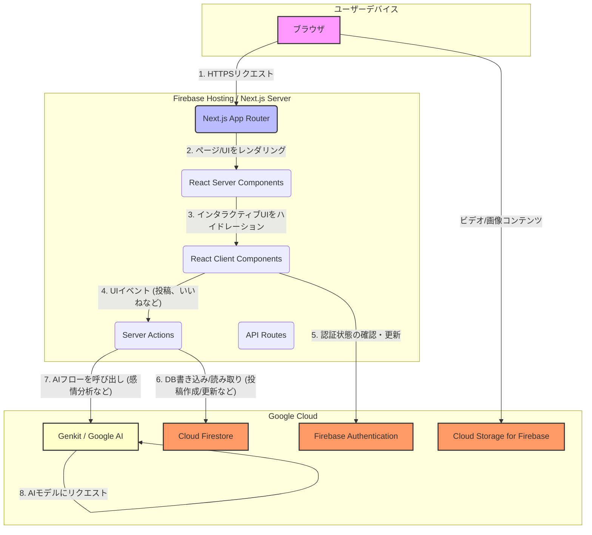

# Philos アプリケーションアーキテクチャ

このドキュメントでは、Philosアプリケーションの技術的な構成とコンポーネント間の連携を視覚的に示します。

---

## 主要コンポーネントの説明

1.  **ユーザーデバイス (ブラウザ)**
    *   ユーザーがアプリケーションにアクセスするためのクライアント環境です。

2.  **Firebase Hosting / Next.js Server**
    *   **Next.js App Router**: アプリケーションのフロントエンドとBFF（Backend for Frontend）の役割を担います。ルーティング、レンダリング、APIエンドポイントなどを管理します。
    *   **React Server Components (RSC)**: サーバーサイドでレンダリングされ、静的なUIを高速にクライアントに配信します。DBからのデータ取得などをサーバー上で行います。
    *   **React Client Components**: クライアントサイドでレンダリングされ、`useState`や`useEffect`などのフックを使用してインタラクティブなUIを実現します。
    *   **Server Actions**: クライアントからのフォーム送信やデータ更新リクエストを、APIルートを作成することなく安全に処理します。
    *   **API Routes**: Next.jsが提供するサーバーレスなAPIエンドポイントです（現在は認証チェックなどに使用）。

3.  **Google Cloud (Firebase / Genkit)**
    *   **Firebase Authentication**: ユーザー認証（ログイン、サインアップなど）を管理します。
    *   **Cloud Firestore**: アプリケーションの主要なデータベース。投稿、ユーザー情報、メッセージなどをリアルタイムで格納・同期します。
    *   **Cloud Storage for Firebase**: 動画やプロフィール画像などの静的ファイルを格納・配信します。
    *   **Genkit / Google AI**: 投稿内容の感情分析や、目標達成時の賞賛メッセージ生成など、生成AI関連の処理を実行するバックエンドサービスです。Next.jsのServer Actions経由で呼び出されます。

## データフローの例 (ユーザーがコメントを投稿)

1.  ユーザーがブラウザ（**A**）でコメントを入力し、投稿ボタンをクリックします。
2.  クライアントコンポーネント（**D**）がイベントを検知し、Server Action（**E**）を呼び出します。
3.  Server Action（**E**）は、まず投稿内容をCloud Firestore（**H**）に保存します。
4.  次に、Server Action（**E**）はGenkitの感情分析フロー（**G**）を呼び出します。
5.  Genkit（**G**）が投稿内容をGoogle AIモデルに送信し、分析結果を受け取ります。
6.  Server Action（**E**）は、受け取った分析結果をFirestore（**H**）の該当投稿ドキュメントに書き込みます。
7.  Firestoreのリアルタイムリスナーがデータの変更を検知し、クライアントコンポーネント（**D**）のUIが自動的に更新されます。
